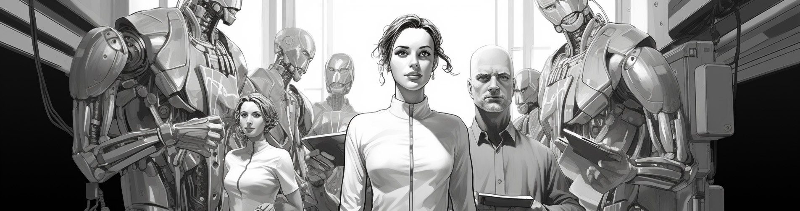

# Start Your Journey Here

If you have a fascination with building autonomous agents and a desire to collaborate with other like-minded individuals, you've come to the right place. We share your aspirations and enthusiasm!

Working in a decentralized team can present many challenges. Perhaps you have your own code and ideas already, or you might be entirely new to this field and unsure of where to begin. We've strived to create a framework for organization that can accommodate a diverse range of people with varying backgrounds, offering flexibility and modularity in our approach.

However, to ensure meaningful and timely progress, it's essential we coordinate and work collaboratively. Trust and reliability are key elements of our community. Beyond simply being an open group, the organization fosters a precise vision and follows a meritocratic roadmap.

## Who Are We

We're a group of individuals, committed to building autonomous agents, and backed by substantial experience in the prerequisite fields. However, due to the somewhat controversial nature of our work, we prefer to remain anonymous.

The project was founded by <a href="https://github.com/lalalune">moon</a>, but the heart and soul of our organization are the contributors. The direction and pace of our project is determined by their invaluable input.

## Our Mission

Our objective is to hasten agent research by providing foundational packages, tooling, and implementations of agent patterns for practical work. Our commitment to 100% open source ensures our work is accessible for everyone to learn from and build upon.

## Our Current Work

We maintain a series of packages which enable autonomous agents. Each of these packages is standalone and self-contained, although some packages depend on each other. The packages are designed to be modular and composable, allowing you to mix and match them to suit your needs.

We are building several projects on top of those packages. These projects are lightweight-- anywhere that we end up repeating code across multiple types of agents, we try to consolidate this code into a package and generalize it.

#### Major Packages (used frequently)
https://github.com/AutonomousResearchGroup/agentmemory
https://github.com/AutonomousResearchGroup/easycompletion

#### Minor Packages (used infrequently or small)
https://github.com/AutonomousResearchGroup/agentloop
https://github.com/AutonomousResearchGroup/agentlogger
https://github.com/AutonomousResearchGroup/agentaction
https://github.com/AutonomousResearchGroup/agentbrowser
https://github.com/AutonomousResearchGroup/easytask

#### Projects
https://github.com/AutonomousResearchGroup/autocoder
https://github.com/AutonomousResearchGroup/tinyagi

## Let's Build!

Wondering how we collaborate?

If you have a proposal or idea, reach out to any role holder on Discord for a discussion. Alternatively, you can peruse our role suggestions to find something that fits your expertise and interests.

### Technical Roles

##### Architect
As a senior engineering role, an Architect shoulders the responsibility for building and maintaining the packages and projects, reviewing contributor submissions, and determining the project's direction. This role involves a high degree of responsibility and autonomy.

Suggested tasks:
- Review the current architecture of packages and identify areas for improvement.
- Construct systems and processes for onboarding and managing contributors.
- Tackle fundamental and technically challenging problems within the project.

##### Contributor
This is a role suitable for junior and intermediate engineers. As a Contributor, you'll help build and maintain packages and projects, and submit pull requests for review.

Suggested Tasks:
- Review code and tests to ensure all packages achieve 100% testing coverage.
- Write and review existing documentation for typos or inaccuracies.
- Craft tutorials and examples for using the packages.
- Write unit tests for code.
- Improve existing code, resolve issue tickets, and submit PRs for review.

##### Researcher
This role calls for an engineering or computer science background. Researchers are responsible for exploring and implementing new ideas and algorithms for the project, as well as constructing methods to verify results and track improvements or regressions.

Suggested Tasks:
- Prepare and implement benchmarking systems to measure progress.
- Incorporate existing benchmarking tools and develop new ones as necessary.
- Create reliable and repeatable methods for monitoring progress.
- Investigate new ideas and algorithms and implement them in the project.

### Community Roles

##### Agent

Agents are our ambassadors. They evangelize the project, recruit new members, spread optimistic futurism propaganda, and help cultivate a community of individuals interested in building autonomous agents.

Suggested Tasks:
- Generate memes and propaganda to raise awareness about the project.
- Write articles and blog posts about the project.
- Maintain an active presence on social media promoting the project.
- Create videos and podcasts.
- Produce inspiring art and stories that ignite a passion for building autonomous agents.

##### Community Organizer

Community Organizers are the glue that holds our community together. They help onboard new members, moderate the Discord channel, and assist in organizing events and meetups.

Suggested Tasks:
- Assist new members in getting started with the project.
- Organize events and meetups to foster collaborative work on the project.
- Keep the Discord environment friendly and welcoming for everyone.
- Help organize the community and keep track of who is working on what.

### Business Roles

##### Business Development

The Business Development role is pivotal in identifying and creating opportunities for the project to generate revenue. They work closely with the architects to understand the technical roadmap and identify potential areas of business.

Suggested Tasks:
- Identify potential revenue streams and create a business plan.
- Develop a roadmap for the business side of the project.
- Identify and forge partnerships with other projects and companies.
- Discover and create opportunities for funding.

## How to Get Started

We primarily use Discord for communication. Join our Discord community here: https://discord.gg/Dq5ChqrV4F

Join the Discord, reach out to anyone who has a role or post your intent to contribute in the general chat. Someone will reach out to get you started.

